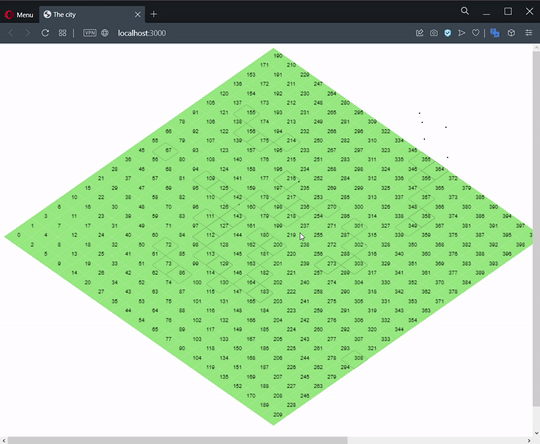

<h1 align="center">The City</h1>

Minigame citybuilder feito com React

Tabela de conteúdos
=================
<!--ts-->
   * [Sobre](#sobre)
   * [Estudo](#estudo)
   * [Pre Requisitos](#pré-requisitos)
   * [Autor](#autor)
<!--te-->

### Sobre

	
Em desenvolvimento

	
Esse projeto é um site que contém um minigame citybuilder, feito com React. Realizado no ano de 2022.

	
	
Selecionando partes do mapa

### Estudo

No projeto será estudado:
- JavaScript
- TypeScript
- Reactjs
- Canvas
- QuadTree (estrutura de dados)

### Pré-requisitos

Antes de começar, você vai precisar ter instalado em sua máquina as seguintes ferramentas: 
- [Git](https://git-scm.com) 
- [VSCode](https://code.visualstudio.com/) ou algum outro programa para realizar a edição de código.

Cria projeto novo com typescript:
``yarn create react-app nome-do-projeto --template typescript``

Adiciona modulo para estilização:
``yarn add styled-components``

Styles components com typescript:
``yarn add @types/styled-components``

Para executar o projeto:
``yarn start``

<h2 align="center">Autor<h3/>

<table align="center">
  <tr>
    <td align="center"><a href="https://github.com/jefersoncmn"> <b>Jeferson Carlos Martin</b></a> 
    </td>
</table>
	
## Meu contato

:mailbox: [jefersoncmn@hotmail.com](jefersoncmn@hotmail.com)

  
